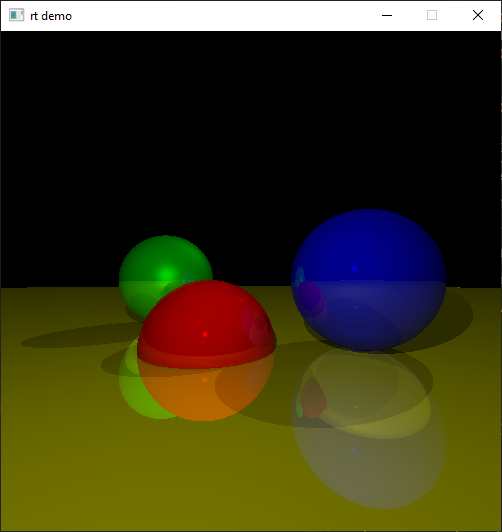
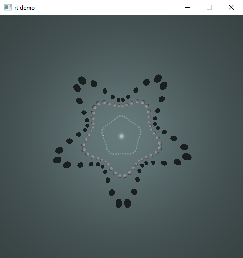
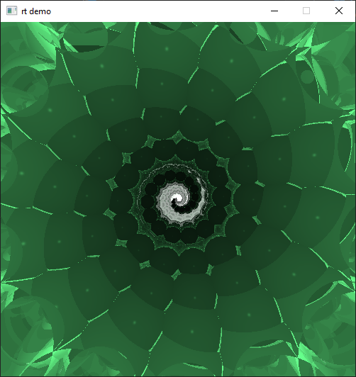

# Ray Tracer Demo
This repo demonstrates a ray tracer written in a fragment shader based on Gabriel Gambetta's [Computer Graphics From Scratch](https://gabrielgambetta.com/computer-graphics-from-scratch/). Uniform buffers are used to send object and light source data to the shader in an STD140 memory layout. You can toggle software rendering on and off, but only GPU rendering provides real time performance.
## Controls
- WASD - Move the camera (some scenes lock the camera position)
- 5 - Toggle Render Mode, pressing 5 once will use the CPU to render subsequent frames (much slower), pressing 5 again will revert to the fragment shader rendering.
- F1 - Change to scene 1:

- F2 - Change to scene 2:

- F3 - Change to scene 3:


## Dependencies
This project uses [SDL2](https://github.com/libsdl-org/SDL/releases/tag/release-2.30.10) and [GLEW](https://glew.sourceforge.net/), the project structure should look like this:
```
src/
lib/
├─ *SDL2 and glew libs*.lib
include/
├─ GL/
│  ├─ *glew headers*.h
├─ *SDL2 headers*.h
SDL2.dll
glew32.dll
```
